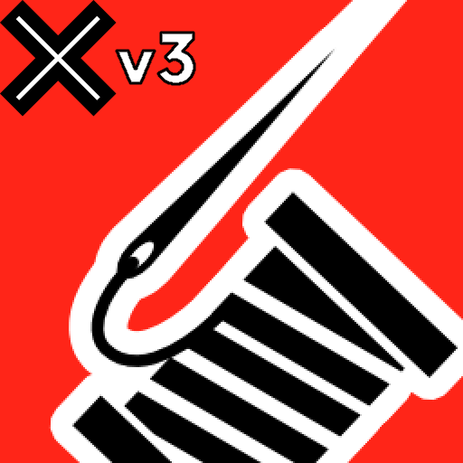

# serilog-sinks-xunit-v3
The xUnit.v3 injectable test output sink for Serilog

**Link to NuGet:** https://www.nuget.org/packages/Serilog.Sinks.XUnit3

## What is it?
It's a package that will allow you to use Serilog for test output in xUnit.v3.

## Installation
dotnet CLI:
```
dotnet add package Serilog.Sinks.XUnit3
```
Package Reference:
```xml
<PackageReference Include="Serilog.Sinks.XUnit3" Version="1.0.0" />
```

## Example usage

In **Unit** tests you can do not think about `ITestOutputHelper`, as it is backed by xUnit.v3 `TestContext.Current.TestOutputHelper` property. This implicit behaviour will not work with **Integration** ones due to TestHost being run in Background Thread.

### Unit tests

```csharp
using Microsoft.Extensions.DependencyInjection;
using Microsoft.Extensions.Logging;

namespace Serilog.Sinks.XUnit3.Tests.Unit;

public class UnitTestsOne
{
    [Fact]
    public void Do_Always_Success()
    {
        using var serviceProvider = new ServiceCollection()
            .AddLogging(x => x.ClearProviders()
                .AddSerilog(new LoggerConfiguration().WriteTo
                    .XUnit3TestOutput()
                    .CreateLogger()))
            .BuildServiceProvider();
        var logger = serviceProvider.GetRequiredService<ILogger<object>>();
        logger.LogInformation("Do");
    }
}
```
If you want to pass `ITestOutputHelper` and `IMessageSink` to `XUnit3TestOutputSink` manually, then you can do this:
```csharp
var sink = new XUnit3TestOutputSink(Options.Create(new XUnit3TestOutputSinkOptions()))
{
    TestOutputHelper = testOutputHelper,
    MessageSink = messageSink
};
```
For more info read the docs: https://xunit.net/docs/capturing-output

### Integration tests

```csharp
using Microsoft.AspNetCore.Mvc.Testing;
using Microsoft.Extensions.DependencyInjection;
using Microsoft.Extensions.Hosting;
using System.Net.Http.Json;

namespace Serilog.Sinks.XUnit3.Tests.Integration;

[CollectionDefinition(nameof(SampleCollection))]
public class SampleCollection : ICollectionFixture<SampleFixture>;

public class SampleFixture : IAsyncLifetime
{
    public SampleFactory Factory { get; private set; } = null!;

    public SampleFixture SetTestOutputHelper(ITestOutputHelper testOutputHelper)
    {
        Factory.SetTestOutputHelper(testOutputHelper);
        return this;
    }

    public ValueTask InitializeAsync()
    {
        Factory = new SampleFactory();
        return ValueTask.CompletedTask;
    }

    public async ValueTask DisposeAsync() => await Factory.DisposeAsync();
}

public class SampleFactory : WebApplicationFactory<Program>
{
    protected override IHost CreateHost(IHostBuilder builder)
    {
        builder.ConfigureServices(services =>
        {
            services.AddSingleton(Options.Create(new XUnit3TestOutputSinkOptions()));
            services.AddSingleton<XUnit3TestOutputSink>();
        });
        builder.UseSerilog((_, serviceProvider, loggerConfiguration) =>
            loggerConfiguration.WriteTo.XUnit3TestOutput(
                serviceProvider.GetRequiredService<XUnit3TestOutputSink>()));

        return base.CreateHost(builder);
    }

    public void SetTestOutputHelper(ITestOutputHelper testOutputHelper) =>
        Services.GetRequiredService<XUnit3TestOutputSink>().TestOutputHelper = testOutputHelper;
}

[Collection(nameof(SampleCollection))]
public class SampleSuccessTests(SampleFixture fixture, ITestOutputHelper testOutputHelper)
{
    private readonly SampleFixture _fixture = fixture.SetTestOutputHelper(testOutputHelper);

    [Fact]
    public async Task Get_ById_Success()
    {
        var client = _fixture.Factory.CreateClient();
        var response = await client.GetFromJsonAsync<Todo>("/todos/1", CancellationToken.None);
        Assert.NotNull(response);
    }
    
    [Fact]
    public async Task Get_List_Success()
    {
        var client = _fixture.Factory.CreateClient();
        var response = await client.GetFromJsonAsync<Todo[]>("/todos", CancellationToken.None);
        Assert.NotNull(response);
    }
}
```